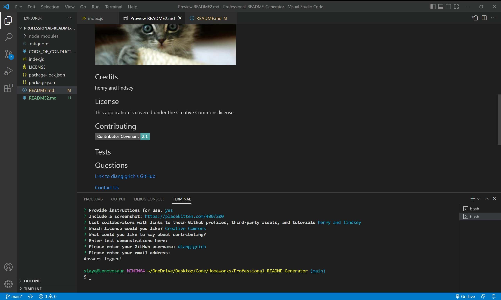

# Professional README Generator

## Description
This project makes it easy and quick to create a README file by providing a template to fill in through the command line.
      
## Table of Contents
* [Installation](#installation)
* [Usage](#usage)
* [Screenshot](#screenshot)
* [Credits](#credits)
* [License](#license)
* [Contributing](#contributing)
* [Tests](#tests)
* [Questions](#questions)
      
## Installation
Once we have our Github, terminal, and vscode ready to go, we need to:
npm init -y
npm install inquirer
npm install fs
      
## Usage
Enter "node index.js" into your command terminal, then it will prompt you with a series of questions. I suggest preparing links and screenshots ahead of time.
      
## Screenshot:

      
## Credits
The TAs at bootcamp: Henry Weigand and Lindsey Fitzgerald, 
Erik Buss for demonstrating "preview readme" which made a huge difference, 
https://coding-boot-camp.github.io/full-stack/github/ for README and screenshot/video assistance

## License
This application is covered under . See repo for license.
      
## Contributing
I still don't understand how to contribute. Someday I will and this is a start!
[Contributor Covenant](https://img.shields.io/badge/Contributor%20Covenant-2.1-4baaaa.svg)]
      
## Tests
[Link to test](https://drive.google.com/file/d/192geTIdJvAGMsAkrfL3bAcioB3VzEqk8/view)
      
## Questions
[Link to diangigrich's GitHub](https://github.com/diangigrich)

[Contact Us](mailto:slayer_barrett_@hotmail.com)